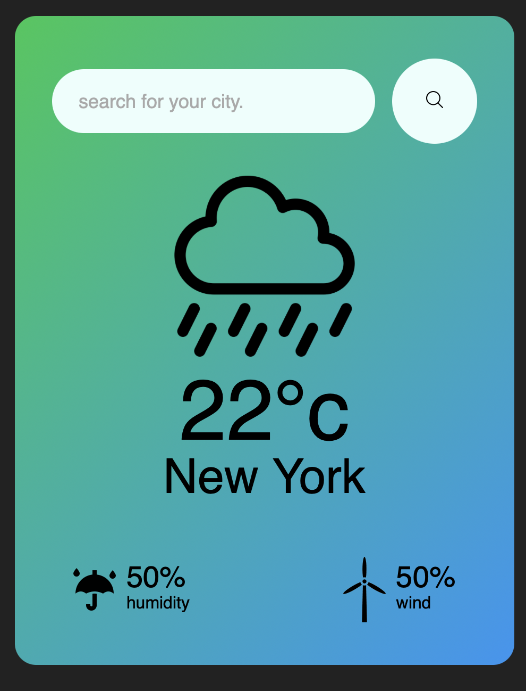
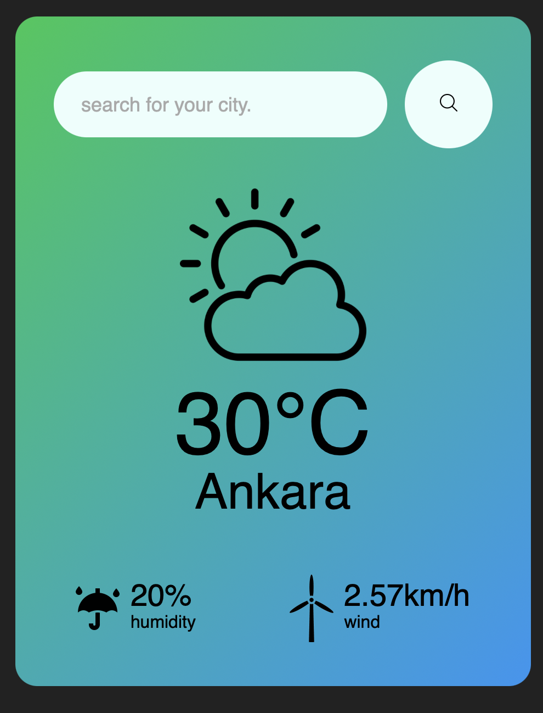

# Weather App

This project is a weather application developed using **HTML**, **CSS**, and **JavaScript**, integrating the **OpenWeather API**. It is my second project with JavaScript, created to practice API usage and improve my skills in reusing functions.

## About the Project

- **Title:** Weather App  
- **Technologies:** HTML5, CSS3, JavaScript (ES6), OpenWeather API  
- **Features:**  
  - Search and display the current weather of any city
  - Dynamic weather information including temperature, humidity, and wind speed
  - Responsive and visually appealing card-based UI
  - Weather icon/image changes based on weather conditions

## Project Structure

- index.html : Main HTML file  
- style.css : Stylesheet  
- script.js : JavaScript code handling API calls and DOM updates  
- Images are stored in the `images/` folder.

## How to Use

1. Clone this project or download it as a ZIP file.  
2. Open the `index.html` file in a modern web browser.  
3. Edit the `script.js` file to add your own OpenWeather API key .

---

## Project Preview

  
  

Thank you! I welcome any feedback and suggestions.
